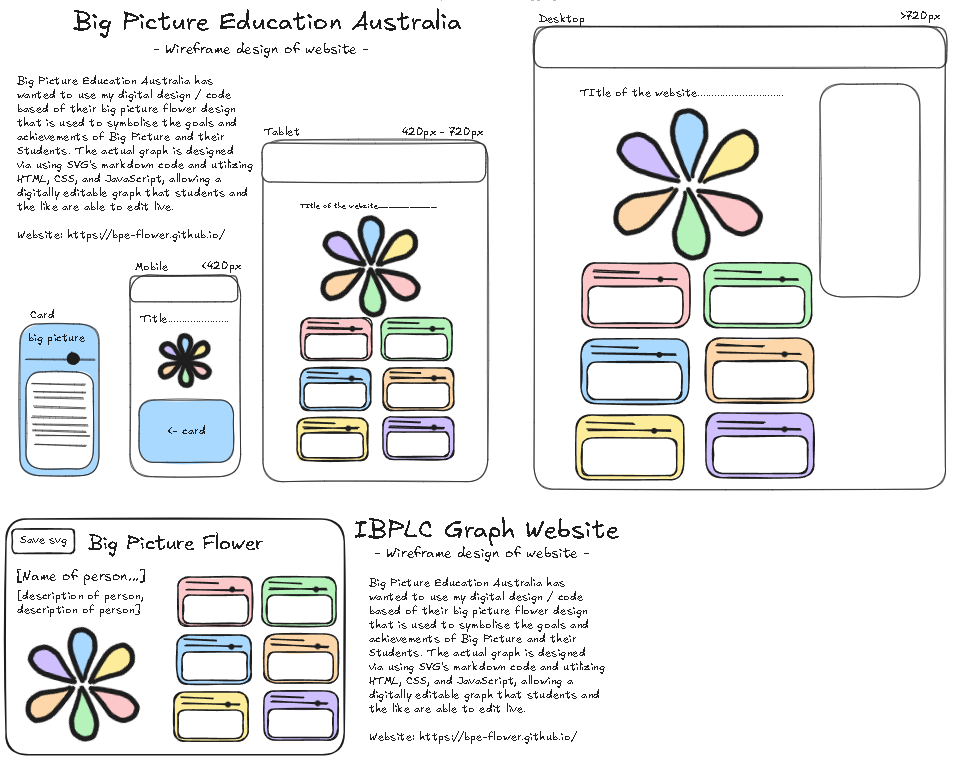

.png)

# Big Picture Education's Flower
This is a repo for a website that was designed to fix an issue that I faced while at [Cooks Hill Campus](https://cookshill-s.schools.nsw.gov.au/) a [Big Picture Education](https://www.bigpicture.org.au/) School. The issue lied in the fact there was no easily accessable, editable, digital version of the Big Picture Flower, a graph made to demonstrate Big Picture learning goals and the achievements of them for students. The graph is commonly used with the IBPLC (International Big Picture Learning Credential) [see below] This website utlizes SVG's markup language to edit an SVG live changing the diamentions of parts of the image. While also displaying what the flower graph shows.

## Wireframe of the app

\
\
\
If you have any feedback, please reach out to me at Squidly1408@Gmail.com
